<p align="center">
  <br>
  <strong style="font-size: 2rem;">YouTube Focus Mode</strong>
</p>

<p align="center">
⭐ YouTube Focus Mode is a lightweight, <strong>open-source</strong> MIT-licensed <strong>browser extension</strong> designed to make YouTube productive and distraction-free. It hides shorts, playables, home feed & search recommendations, comments, and other distracting UI elements, letting you watch only what you choose
</p>

---

🎯 **YouTube Focus Mode** is available here: [Chrome](https://chromewebstore.google.com/detail/youtube-focus-mode-%E2%80%93-no-d/iojlgfppmfhnlmmohajhofjjgnhkcmbg)


## Features

### 🏠 Hide Home Feed & Left Sidebar
| Before | After |
|--------|-------|
| 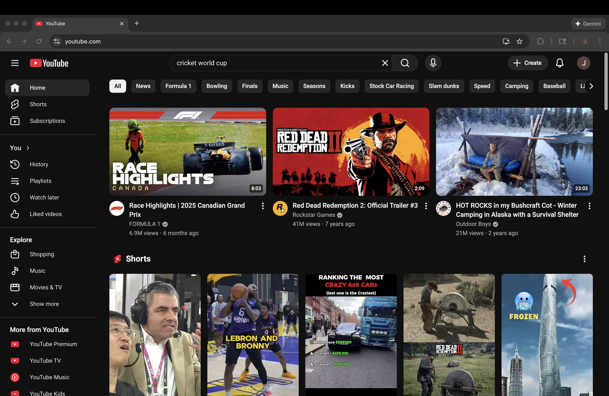 | 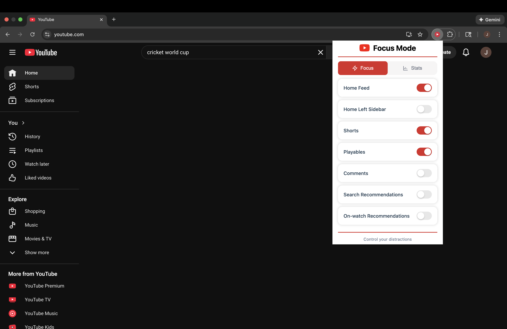 |

### 📊 Stats
| Today | This Week |
|--------|-------|
|  |  |


| This Month | All Time |
|--------|-------|
|  | 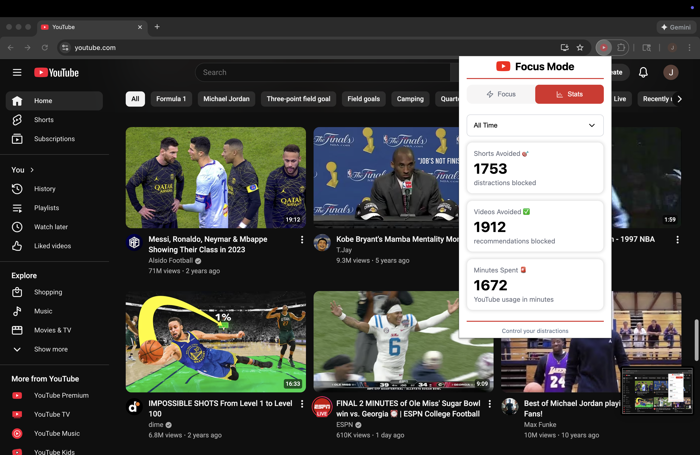 |


### 🎯 Hide Shorts
| Before | After |
|--------|-------|
| 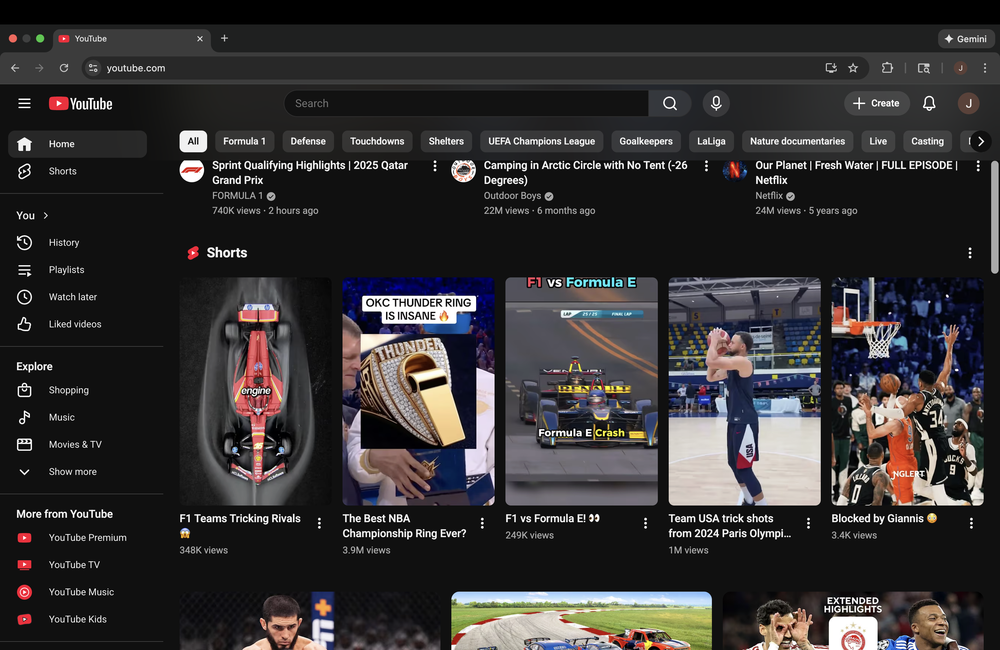 | 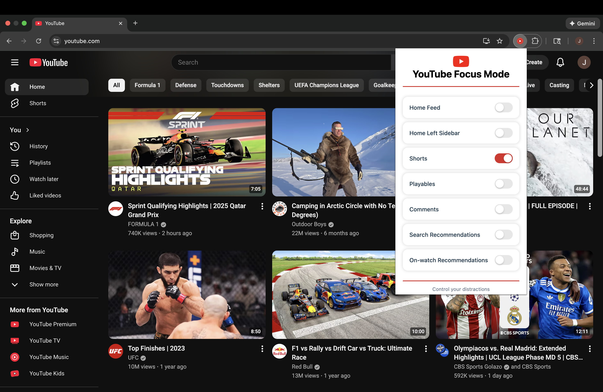 |

### 🎮 Hide Playables
| Before | After |
|--------|-------|
| 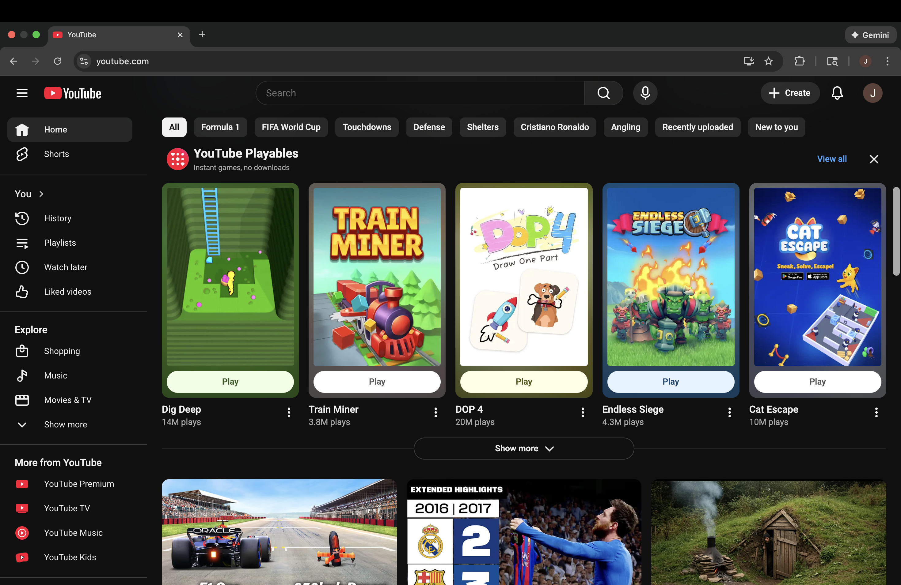 | 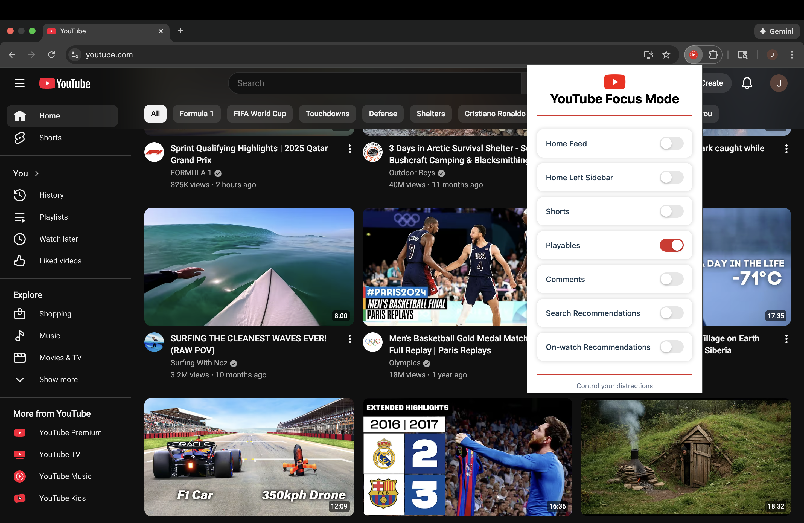 |

### 🔍 Hide Search Recommendations
| Before | After |
|--------|-------|
| 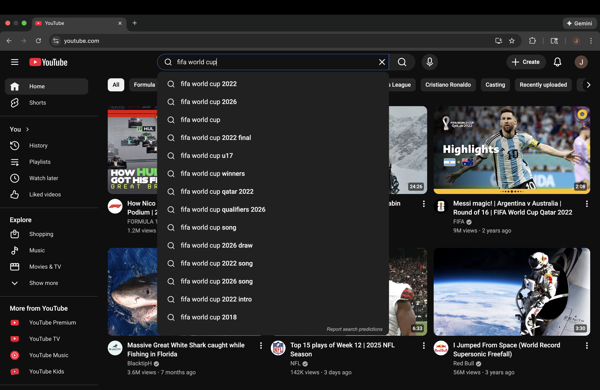 | 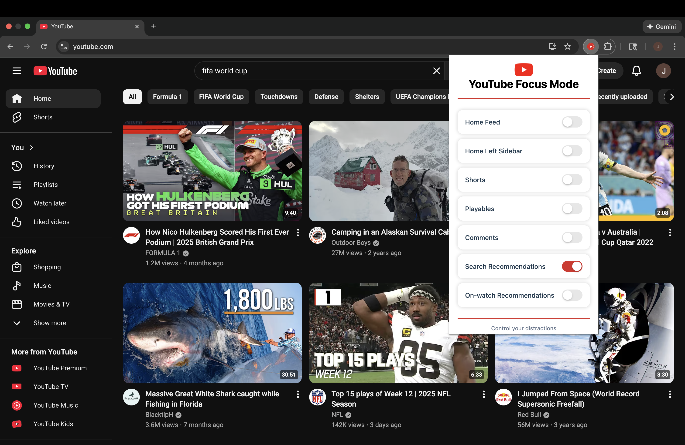 |

### ▶️ Hide On-Watch Recommendations
| Before | After |
|--------|-------|
| 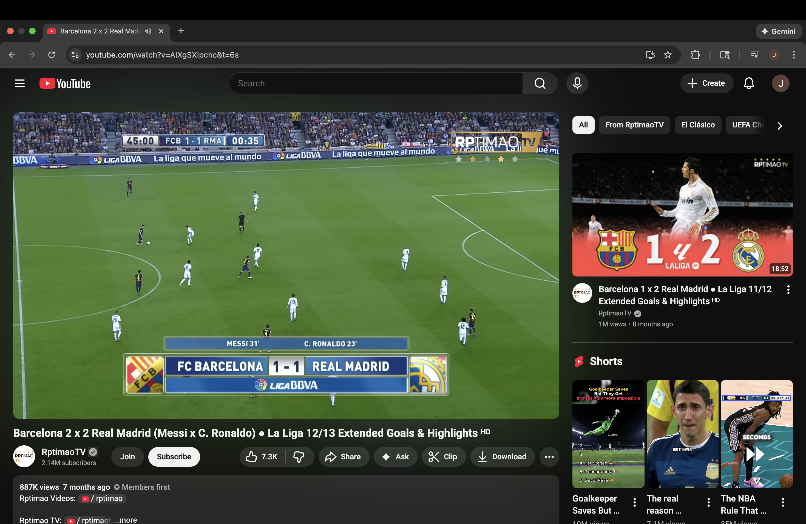 | 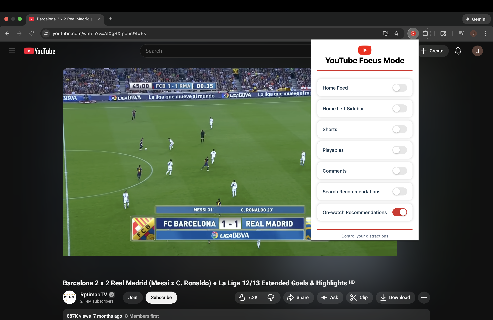 |

### 💬 Hide Comments
| Before | After |
|--------|-------|
| 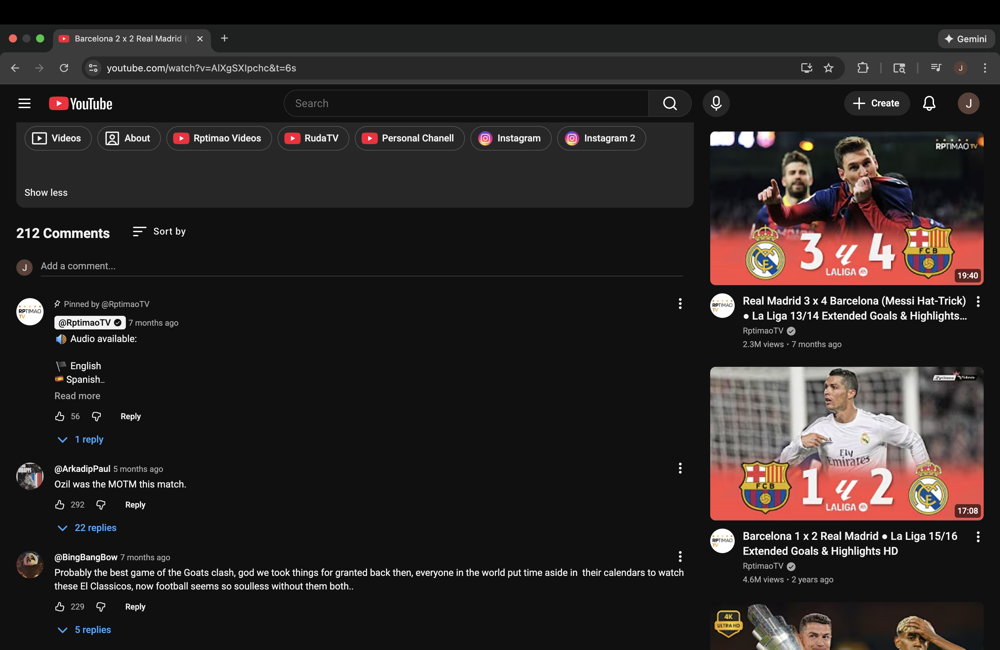 | 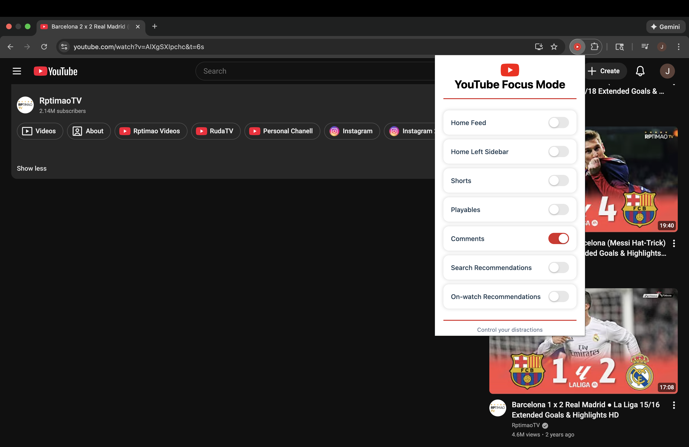 |

---

## 📁 Project Structure
```
├── screenshots/
├── src/
│   ├── icons/
│   │   ├── icon-16.png
│   │   ├── icon-24.png
│   │   ├── icon-32.png
│   │   ├── icon-64.png
│   │   ├── icon-128.png
│   │   └── youtube.png
│   ├── popup/
│   │   ├── popup.css
│   │   ├── popup.html
│   │   └── popup.js
│   ├── scripts/
│   │   ├── features/
|   │   │   ├── home-feed.js
|   │   │   ├── on-watch-recommendations.js
|   │   │   ├── shorts.js
│   │   ├── content.js
│   │   ├── storage.js
│   ├── styles/
│   │   ├── content.css
│   └── manifest.json
├── .gitignore
├── LICENSE
└── PRIVACY.md
└── README.md
```

---

## 🛠️ Installation (Developer Mode)

1. Clone or download this repository
2. Open Chrome and go to: `chrome://extensions/`
3. Enable **Developer mode** (top-right)
4. Click **Load unpacked**
5. Select the `src/` folder
6. YouTube Focus Mode will appear in your Extensions list

---

## 🔒 Privacy

YouTube Focus Mode is privacy-first. It does **not**:

- Collect or track user data  
- Use analytics  
- Send any information to external servers  

All functionality runs **locally** in your browser.

---

## 🙌 Credits
The main icon used in this project is provided by:
- Flaticon – [Play button icons created by Alfredo Hernandez](https://www.flaticon.com/free-icons/play-button)  
